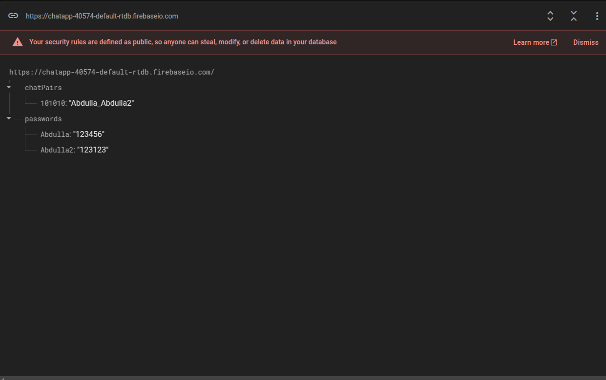
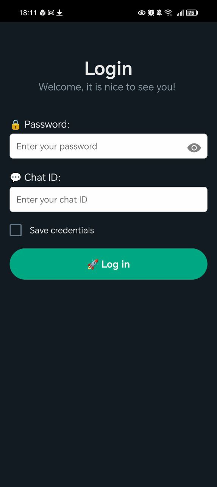
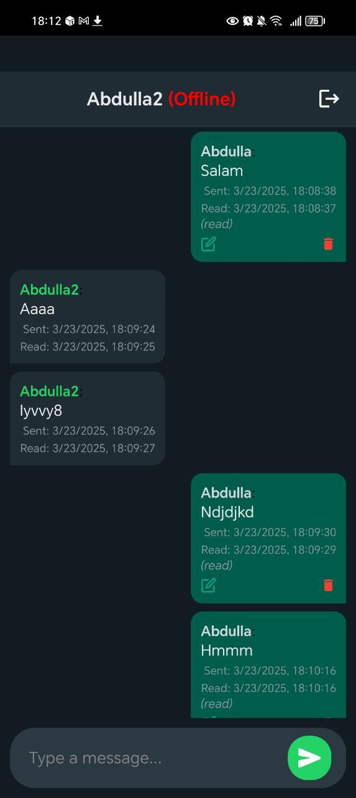

# 💬 ChatX — Personal Chat App with Firebase Realtime DB

**ChatX** is a lightweight and secure chat application built with **React Native (Expo)** and **Firebase Realtime Database**.  
⚠️ This app is intended for **personal use only**.

> No one can take screenshots inside the app. ❌📸

---

## 🔧 Setup Instructions

1. Clone this repository.
2. Create a Firebase project at [Firebase Console](https://console.firebase.google.com/).
3. Enable **Realtime Database**.
4. Replace the Firebase config in the code with your own:

```js
const firebaseConfig = {
  apiKey: "YOUR_API_KEY",
  authDomain: "YOUR_PROJECT_ID.firebaseapp.com",
  databaseURL: "https://YOUR_PROJECT_ID.firebaseio.com",
  projectId: "YOUR_PROJECT_ID",
  storageBucket: "YOUR_PROJECT_ID.appspot.com",
  messagingSenderId: "YOUR_SENDER_ID",
  appId: "YOUR_APP_ID"
};
```

---

## 🧠 How the Database Works

You need to **manually** set up the database structure in Firebase Realtime Database.

### 🔐 1. Add Users & Passwords

Go to your Firebase Realtime Database and add a `passwords` node like this:

```json
"passwords": {
  "Username1": "Password1",
  "Username2": "Password2"
}
```

➡️ These are the login credentials you will **manually** create and share with the person you want to chat with.

### 🧑‍🤝‍🧑 2. Define Chat Pairs

Create a `chatPairs` node to define who can chat with whom.

```json
"chatPairs": {
  "101010": "Username1_Username2"
}
```

➡️ The value is a string in the format: `"User1_User2"`  
➡️ You can use any unique key (like `"101010"`) for the pair.

<div align="center">
  
  
  
</div>

---

## 🚫 Screenshots Disabled

Screenshots are **completely disabled** inside the app to protect private conversations. 🔒

---

## 🛡️ Important: Secure Your Firebase Rules

By default, Firebase may allow public read/write access.  
**You MUST update your security rules before going live**.

Here’s an example for authenticated-only access:

```json
{
  "rules": {
    ".read": "1",
    ".write": "1"
  }
}
```

You can further customize rules based on your app structure.

---

## 🚀 Running the App

Once everything is set up:

```bash
npx expo start
```

Scan the QR code using **Expo Go** and you're ready to chat!

---

## ⚠️ Note

- This app is not for public use.
- You are responsible for setting up users and sharing credentials securely.
- Firebase credentials and rules are managed **entirely by you**.

---

📬 For feedback or questions, open an issue or contact the maintainer.
